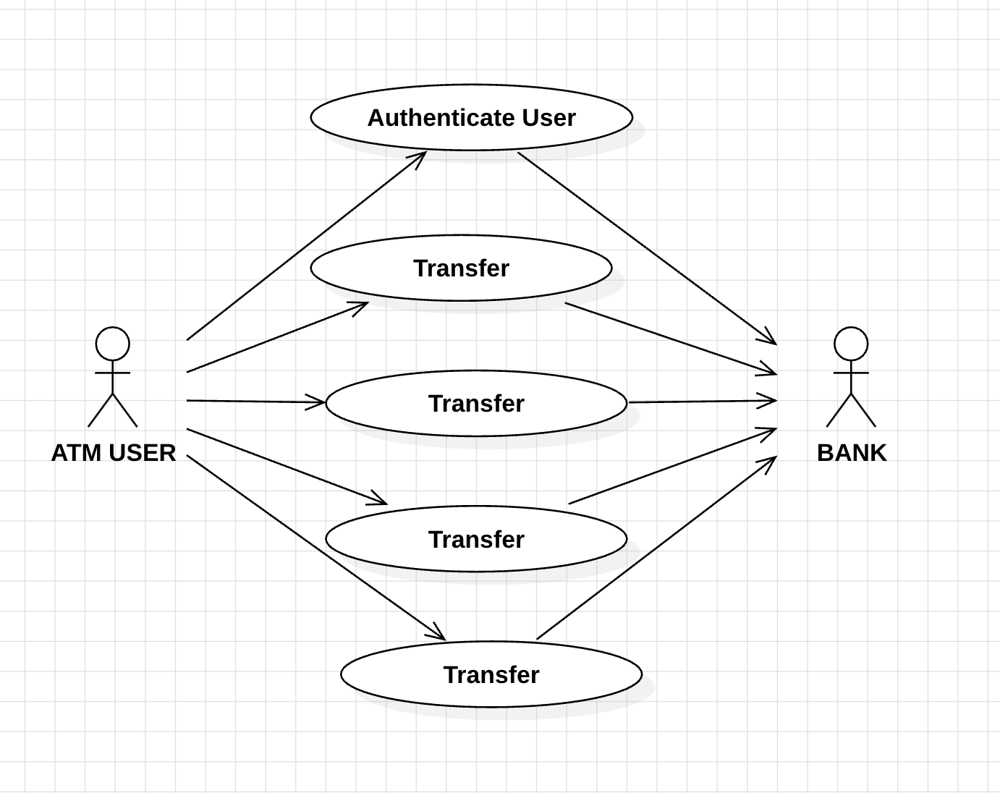
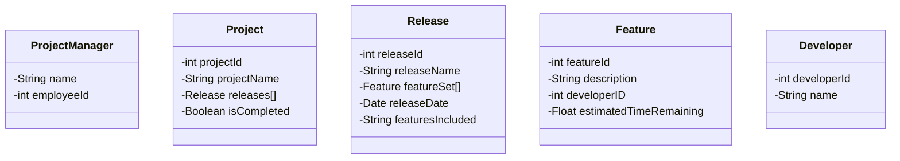
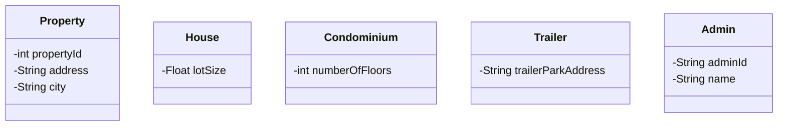

# Lab 1

> Reading: Beginning Java Objects, pp. 344-347, 352, 355-368. Also, read p. 416 for an example of a Use Case description for the Student Registration System.

1. Below is a table showing the first step in a use case description for the main flow of the Withdraw Money use case for an ATM system. Use your experience with ATM machines to help you fill out the rest of the table. The goal of the Withdraw Money use case is, of course, to withdraw money from your account, and in the Main Flow of this use case, the goal is achieved as expected.
˘˘˘¯¯¯˘¯˘...>>>>
### WITHDRAW_MONEY Use Case Description: Main Flow

| User Acti˘˘on                                      | System Response                                              |
|:---------------------------------------------------| ------------------------------------------------------------ |
| User types in PIN into main screen                 | System checks validity of PIN and presents options to user on another screen |
| User select "Withdraw" option                      | System save type and request type of account                 |
| User selects "type account" "saving" or "Checking" | System save the type account  selected and system request amount to withdraw |
| User confirmed transactions                        | System displays the amount of user requests.                 |
| User accept or decline print recept                | System ask if user want to print transaction                 |
| User take money                                    | System release money an deducts it form user's account       |
|                                                    |                                                              |

### Guidelines:

1. Fill in the table, seeing through the eyes of a user of the system. The user is trying to achieve a goal (in this case, Withdraw Money). In the left column, the user initiates some action, often in response to the system's behavior. For each user action, the system responds in some way. The table helps you break down the process into well-defined steps

2. In each cell in the left column, limit yourself to just one user action; don't put multiple actions in a single cell. In the right column, put the precise response the system will do for this particular flow (in this case, the Main Flow). Do not include other potential steps that "might" take. For instance, it might be that the user's PIN is incorrect. But for the Main Flow, the PIN is correct, so we do not mention that possibility in this table. (It would be addressed in a separate flow.) Rule of Thumb: No branching logic should appear in a use-case description.

3. Write a user story from the perspective of an ATM user trying to withdraw money.

   **As a  ATM user, I want to withdraw my savings from an account.**

----------

2. Create a User Case Diagram for the ATM system (refer to the slides for the three use cases that you will use). there shoud be two actors.

   

   

---

3. The Project Management Tracking System. The following is a problem statement for building a simple project management tool. The tool would be used by a Project Manager (who would be an Actor in relation to this system, and we can assume that the final system will have a user interface which would be used by the Project Manager. Use the techniques discussed in class to create a static model

\- identify the classes for this system and determine the attributes that belong to each class. We will develop this example further in Lab For this lab, you do not need to specify associations or operations.

> Problem Description:
>
> A Project Manager manages multiple projects. A project, before final release, is required to have a specified feature set. Associated with a project are multiple releases. A release is a functional piece of the project being developed that includes a subset of the feature set for the project and which is to be delivered on a specified date (the feature set and release date are determined by the Project Manager). When the last release is delivered, the project is considered completed.
>
> Associated with each feature for a project is a developer who is responsible for developing this feature for inclusion in the project. A developer has an id and provides, for each feature he is responsible for, the estimated time remaining to complete work on that feature. The Project Manager assigns features to developers to work on.

For this lab, draw (by hand or using a UML tool) a class diagram to model this system. Your diagram should include all classes and attributes suggested by the problem statement. (And to repeat, you do not need to specify operations or associations. Also, you do not need to create a special class to represent the user interface.)

________

4. **Properties Management System.** The following is a problem statement for a simple properties management system, which would be used by a manager of multiple properties. Use the techniques discussed in class to create a static model - identify the classes for this system and determine the attributes that belong to each class. We will develop this example further later on - for this lab, you do not need to specify associations or operations.

Problem Description:

A landlord owns several types of properties: houses, condominiums, and trailers.

A house has an address and a lot size. Rent for a house is computed by

rent = 0.1 * lot size

A condominium has an address and a certain number of floors (1 floor, 2 floors, or 3 floors). Rent for a condominium is computed by

rent = 400 * number of floors

A trailer belongs to a particular trailer park (specified by the trailer park address).

The rent for a trailer is always $500.

The property managemet software is required to have an Admin module that supports various functions. One of these functions is to compute total rent for all the properties registered in the system. Another function is to list all properties in the system that are in a specified city.

For this lab, draw (or use a UML tool if you like) a class diagram to model this system. Your diagram should include all classes and attributes suggested by the problem statement. (And to repeat, you do not need to specify operations or associations. Also, you do not need to create a special class to represent the user interface.)

