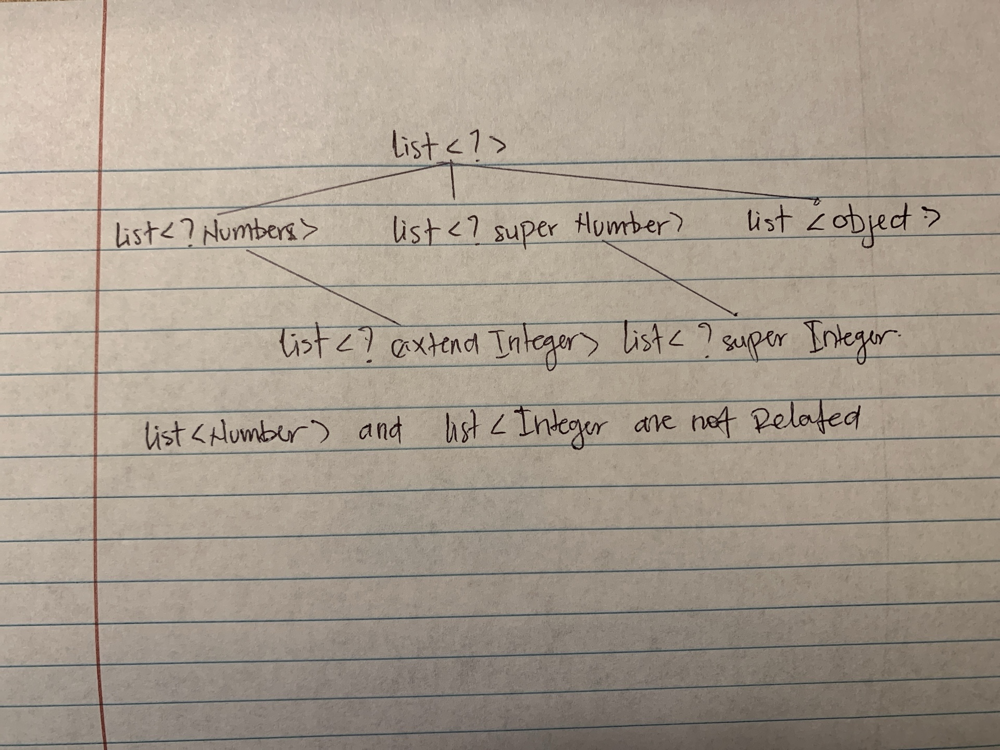

# Lab 13 – Generics and Wildcards in Java


### 1. Consider the following code fragments. For each, if there is a compiler error, identify where it occurs.
```java
//a. First fragment
   List<Integer> ints = new ArrayList<>();
   ints.add(1);
   ints.add(2);
   List<Number> nums = ints;
   nums.add(3.14);
   
 //  a. The error is on List<Number> nums = ints; assigned a list of numbers, which is not allowed by java in generics becausre they are not covariant

```

```java

//b. Second fragment:
List<Integer> ints = new ArrayList<>();
ints.add(1);
ints.add(2);
List<? extends Number> nums = ints;
nums.add(3.14);
// b. The error is on nums.add(3.14); because nums is a list of an unknown type that extends Number, and you cannot add elements to it.
```

###  2 fix the code by capturing the wildCard with a helper method. 

An example of a group is the set of integers {. . . -2, -1, 0, 1, 2, . . . }, with special element 0.
Here is a representation of a group as a Java class:

```java
public class Group<T> {
  	private T specialElement;
		private List<T> elements = new ArrayList<>();
		public Group(T special, List<T> elements) {
      this.specialElement = special;
		  this.elements = elements;
    }
}
```


### 3 Class diagram



### 4 Recall the definition of sum given in the slides:


```java
        List<Integer> ints = new ArrayList<>();
        ints.add(1);
        ints.add(2);
        List<? extends Number> nums = ints;
        double dbl = sum(nums);
        //nums.add(3.14); // we have ? and this ? is some child of number that we don't know, so the program doesn't know what type are we going to enter


        List<Object> objs = new ArrayList<>();
        objs.add(1);
        objs.add("two");
        List<? super Integer> intsB = objs;
        ints.add(3);
        //double dbl1 = sum(intsB); //we do not know if the actual elements inside intsB are Number or not
```


### 5 Generic Problem [Code on Github]