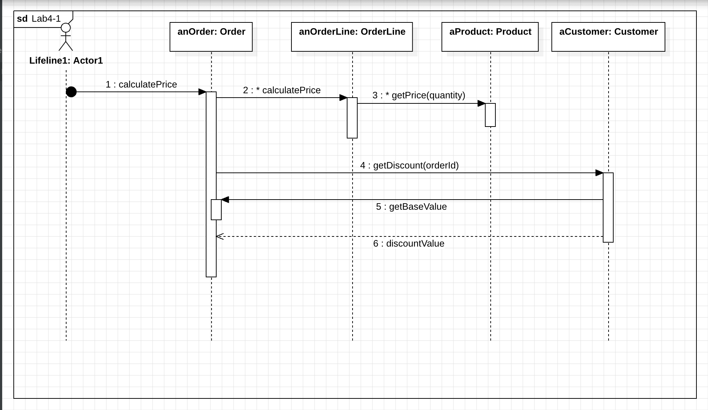
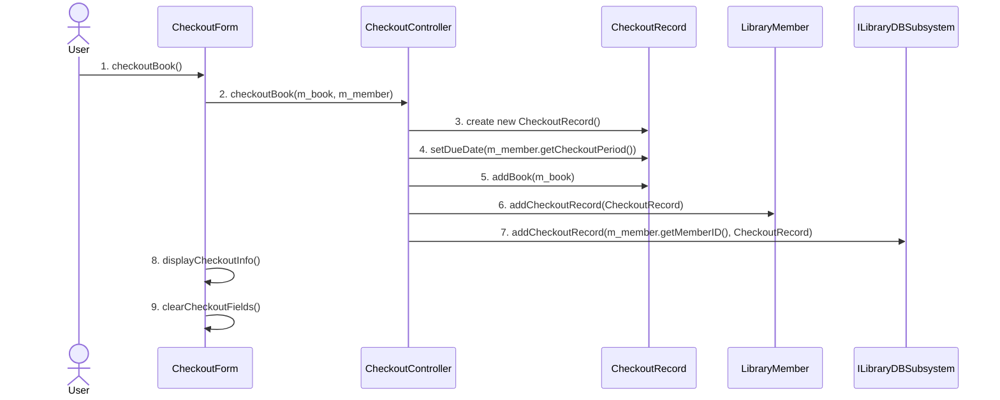
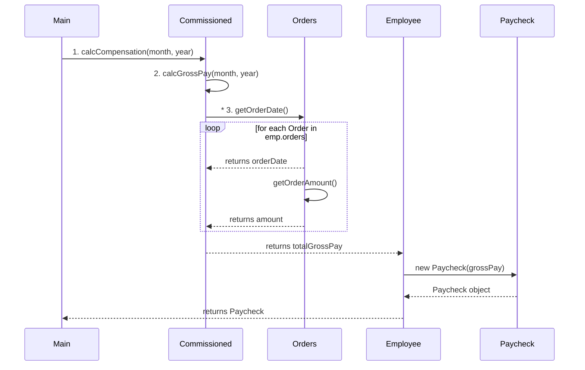

# Lab 4

#### A.  Re-draw the diagram so that it follows UML synatx rules. 

Considered points: 

* Include message numbering 
* Use proper UML syntax for the objects displayed at the top. 
* Indicate looping wherever it occurs with Iteration markers 

#### **B**. Create a sequence diagram based on the flow that occurs when an actor invokes the checkoutBook() method on CheckoutForm

------------

### POLYMORPHISM
#### Payroll Calculation

Part D

