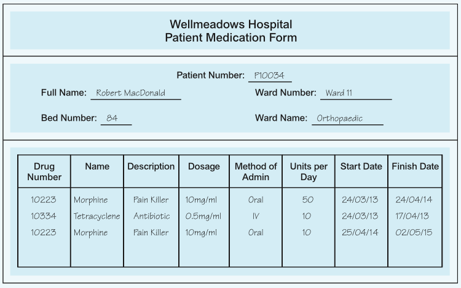
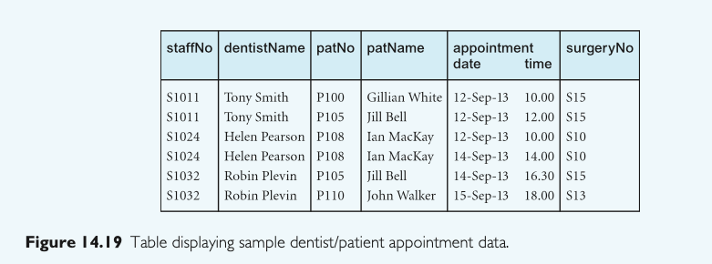

# Lab 6

>  Lab Assignment (Refer to pages 476 and 477) --> Please solve problems 14.14 and 14.15

#### **14.14** 

Examine the Patient Medication Form for the *Wellmeadows Hospital* case study (see Appendix B) shown in

**Figure 14.18.**

**(a)** Identify the functional dependencies represented by the attributes shown in the form in Figure 14.18. State any assumptions that you make about the data and the attributes shown in this form.

**(b)** Describe and illustrate the process of normalizing the attributes shown in Figure 14.18 to produce a set of well-designed 3NF relations.

**(c)** Identify the primary, alternate, and foreign keys in your 3NF relations.

#### Assumptions.

* Each patient has a unique number identifier. (Patien Number).
* Each patiens has a unique room in a  ward.
* Each drug  has a unique identifier.
* Each patient can be administered a drug multiple times.

#### Funtional dependencies

* PID → Patien Number
* PName → Full Name
* BedNo → Bed Number
* WardNo → Ward Number
* WardName → Ward Name
* DrugId → Drug Number
* DrugName → DrugName
* Desc → Drug Description
* Dosage → Dosage
* Dosage → Dosage
* Method → Method of Administration
* Units → Units per Day
* SDate → Start Date
* FDate → Finish Date

#### Key Functional Dependencies:

* PID → PName, BedNo, WardNo, WardName 
* WardNo → WardName
* DrugId → DrugName, Desc, Dosage

#### 1NF – Eliminate Repeating Groups

Already in 1NF — all values are atomic.

#### 2NF – Eliminate Partial Dependencies

| Table | Attributes                 | Primary Key |
| ------- | -------------------------- | ----------- |
| Patient | PID, FullName, BedNo | PatientNo(PID) |
| Ward    | WardNo, WardName | WardNo |
|     Drug    | DrugId, DrugName, Description, Dosage | DrugId |
| Medication | PatientNo, DrugId, StartDate, Method, Units/Day, FinishDate | PatientNo, DrugNo, StartDate |

#### 3NF – Schema summary

* Patient(PID, PName, BedNo, WardNo)
* Ward(WardNo, WardName)
* Drug(DNO, DName, Desc, Dosage)
* Medication(PNO, DNO, SDate, Method, Units, FDate)

-------------

### **14.15** 

The table shown in Figure 14.19 lists sample dentist/patient appointment data. A patient is given an appointment at a specific time and date with a dentist located at a particular surgery. On each day of patient appointments, a dentist is allocated to a specific surgery for that day.

**(a)** The table shown in Figure 14.19 is susceptible to update anomalies. Provide examples of insertion, deletion, and update anomalies.

**(b)** Identify the functional dependencies represented by the attributes shown in the table of Figure 14.19. State any assumptions you make about the data and the attributes shown in this table.

**(c)** Describe and illustrate the process of normalizing the table shown in Figure 14.19 to 3NF relations. Identify the primary, alternate, and foreign keys in your 3NF relations.

 

## (a) Susceptible anomalies

#### Insertion Anomaly

* There is no a primary key, it is supposed to be  surgeryNo, but it is not normalized allowing repeted appointments .
* Every insertion mean to repeat values like patName
* appointment time has a wrong format.

#### Deletion Anomaly

- If a patient's appointment is deleted, the associated dentist or surgery information might also be lost.
  - Example: If  surgeryNo S15 is deleted it will delete 3 records for different patients.

#### Update Anomaly

- Dentist’s name or Surgery number needs to be updated in multiple places.
  - Example: Changing *Robin Plevin*'s surgery from `S15` to `S17` would require updating **multiple rows**.

##  (b) Functional Dependencies (FDs)

### Assumptions:

- `staffNo` uniquely identifies a **dentist**.
- `patNo` uniquely identifies a **patient**.
- A patient can have **only one appointment** at a time with a dentist.
- A **surgery number** is assigned to a **dentist per date**.

------

### Functional Dependencies:

1. **staffNo → DN** *(staffNo determines dentistName)*
2. **patNo → patName** *(patNo determines patName)*
3. **staffNo, appointment_date → surgeryNo** *(on a specific date, a dentist uses a specific surgery)*
4. **patNo, appointment_date, appointment_time → staffNo, surgeryNo** *(a specific appointment identifies dentist and surgery)*

### Final 3NF Relations

| Relation              | Attributes                                       | Primary Key                               | Foreign Keys                       |
| --------------------- | ------------------------------------------------ | ----------------------------------------- | ---------------------------------- |
| **Dentist**           | staffNo, dentistName                             | staffNo                                   | —                                  |
| **Patient**           | patNo, patName                                   | patNo                                     | —                                  |
| **SurgeryAssignment** | staffNo, appointmentDate, surgeryNo              | (staffNo, appointmentDate)                | staffNo → Dentist                  |
| **Appointment**       | patNo, appointmentDate, appointmentTime, staffNo | (patNo, appointmentDate, appointmentTime) | patNo → Patient, staffNo → Dentist |