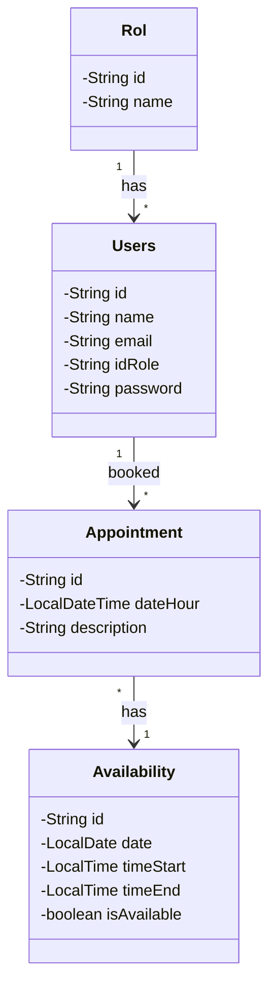
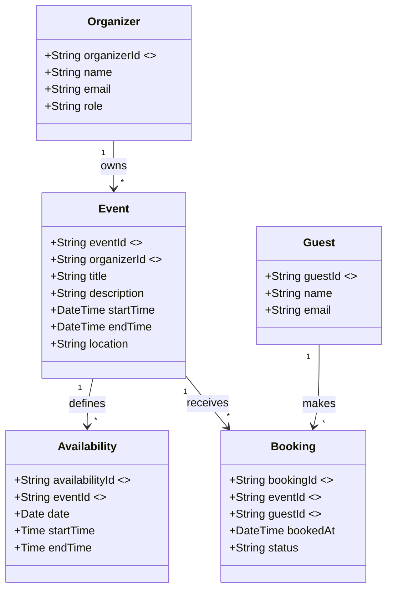

# MPP - Final Project

```mermaid
%% Diagrama de clases básico
classDiagram
  class Users {
    -String id
    -String name
    -String email
    -String idRole
    -String password
  }

  class Availability {
    -String id
    -LocalDate date
    -LocalTime timeStart
    -LocalTime timeEnd
    -boolean isAvailable
  }

  class Appointment {
    -String id
    -LocalDateTime dateHour
    -String description
  }

  class Rol {
    -String id
    -String name
  }

  Users "1" --> "*" Appointment : booked
  Rol "1" --> "*" Users : has
  Appointment "*" --> "1" Availability : has

```

```mermaid
classDiagram
    class Organizer {
        +String organizerId <<PK>>
        +String name
        +String email
        +String role
    }

    class Event {
        +String eventId <<PK>>
        +String organizerId <<FK>>
        +String title
        +String description
        +DateTime startTime
        +DateTime endTime
        +String location
    }

    class Availability {
        +String availabilityId <<PK>>
        +String eventId <<FK>>
        +Date date
        +Time startTime
        +Time endTime
    }

    class Booking {
        +String bookingId <<PK>>
        +String eventId <<FK>>
        +String guestId <<FK>>
        +DateTime bookedAt
        +String status
    }

    class Guest {
        +String guestId <<PK>>
        +String name
        +String email
    }

    %% Relationships (foreign key associations)
    Organizer "1" --> "*" Event : owns
    Event "1" --> "*" Availability : defines
    Event "1" --> "*" Booking : receives
    Guest "1" --> "*" Booking : makes

```

