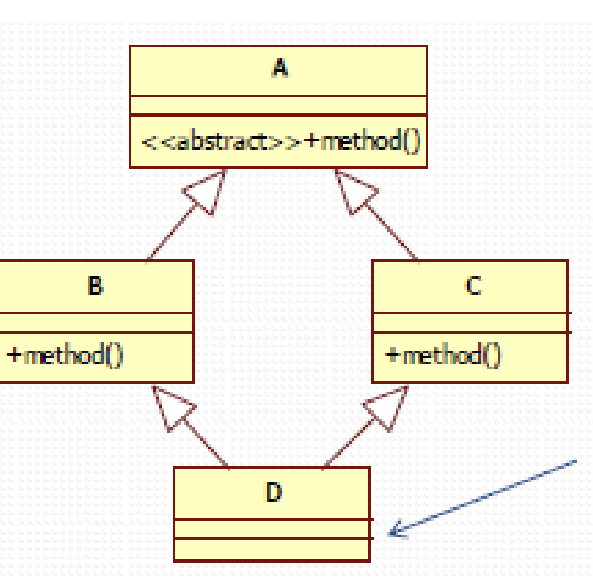

# Lab9

Short Answer

A. Java’s ArrayList implements 6 interfaces and extends one class. What are they?

Parts B – D of this Problem refer to code in package lesson09.labs.prob1, in which you are

trying to remove duplicates from a List and then test that your output is correct. All three attempts

to solve this problem are incorrect in some way (when you run the code, output message indicates

that the procedure fails). Explain, in each case, what is wrong with the solution. Place each of your

answers in a text file in the relevant package.

* **PartB:** The method equals() is not overriding, is overloaded which is not recognized in java as a equality mechanism. 

  As a result, when the code tries to check if an Employee is in a list (using contains), it does not use logical equality based on name and salary.
It falls back to reference equality (==), which fails unless it's the exact same object reference.
  
  To fix it, override equals(Object) and implement hashCode accordingly

* **Part C:**  The removeDuplicates method uses a HashMap<Employee, Employee> to detect duplicates. The reason why is not working is becasue hashmap uses hash code to compare if an object is equals than another. but in this case it was created. 
  As a result, the code tries to use the hashMap method containsKey, inside it will use an id (hash code) to find the value. 

* **Part D:** This HasMap uses equals() and hashCode()   which are implemented correctly.

  However, in this case, the equals() method includes the 'visited' field, which is mutable. When an Employee is marked as visited after insertion, it changes the object's equality and hash code.

  This breaks the contract of HashMap, because the object's hash changes while it's being used as a key. As a result, lookups and containsKey(e) may fail even though the entry exists.

  Fix: Remove 'visited' from the equals() and hashCode() methods. Only include immutable identifying fields like name and salary.

  

---------------------

**E.** Lesson 5 introduced the Diamond Problem that must be handled by any language that supports

multiple inheritance. Java SE 8 now supports “behavioral” multiple inheritance (but not “data”

multiple inheritance). Explain how features of Java 8 handle the Diamond Problem by

considering two scenarios:

* **When the type D is a class**

  In java it is not possible to implement two classes in type D, Java does not support multiple class inheritance

* **When the type D is an interface.**

  if type D is an interface it is not possible to extent a class only it is possible to extend another interface.

  but In case that A, B C, D were be interfaces, java allow interface to have default method, in case of conflict from 2 interfaces method, java force to override the conflicting method to resolve ambiguity

