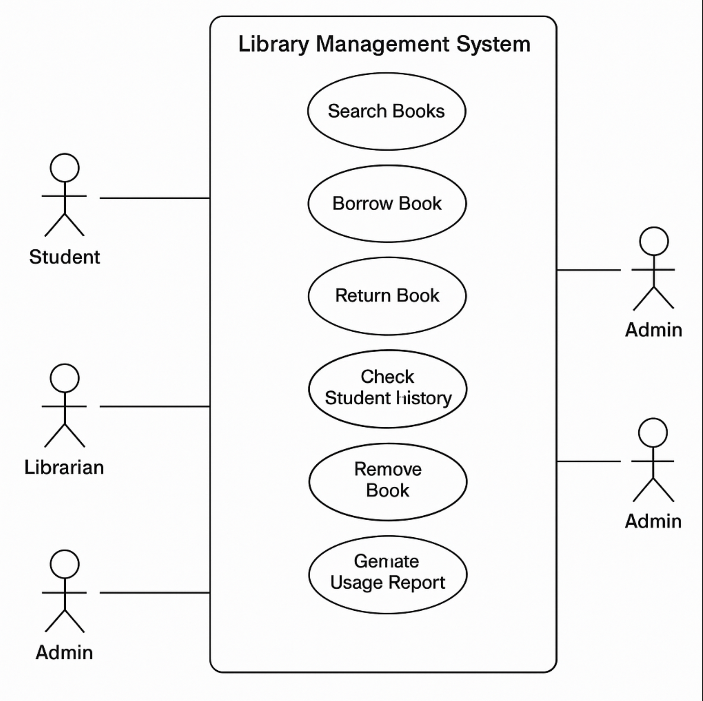

# MED-TERM-EXAM PRACTICE

## EX 1
You are designing an online Library Management System for a university. The main users are Students, Librarians, and Administrators. The system should allow the following:
* Students can search for books, borrow available books, return borrowed books, and view their borrowing history.
* Librarians can add new books, update book information, and remove books from the library. They can also check the borrowing history of any student.
* Administrators can create or remove librarian and student accounts, and generate reports on library usage.
### Tasks
### Identify at least THREE user stories for each type of user (Student, Librarian, Administrator).
  * **Student User Stories**
    * As a student, I want to search books that I'm interested in.
    * As a student, I want to borrow available books so that I can study with them.
    * As a student, I want to return books so that I don't fall into a fine.
  * **Librarians User Stories**
    * As a Librarians, I want to add, update and remove book.
    * As a Librarians, I want to see history students borrowed book so that I can track books
    * As a Librarians, I want to ........ 
  * **Administrator User Stories**
    * As an admin, I want to create librarian and student accounts so new users can access the system.
    * As an admin, I want to remove accounts so unused ones are cleaned up. 
    * As an admin, I want to generate usage reports so I can analyze library activity..
    
### Write at least ONE detailed use case for each type of user.
* Use the standard use case format: Title, Actor, Main Flow, etc. 

   ### 🧑‍🎓 **Use Case: Borrow Book**

   - **Title:** Borrow Book
   - **Actor:** Student
   - **Precondition:** Student is logged in and has no overdue books.
   - **Main Flow:**
     1. Student searches for a book.
     2. System displays availability.
     3. Student selects “Borrow.”
     4. System checks if book is available.
     5. System updates book status to “borrowed” and assigns it to student.
     6. System shows due date.

   ### 📚 **Use Case: Add Book to Library**

   - **Title:** Add New Book
   - **Actor:** Librarian
   - **Precondition:** Librarian is logged in.
   - **Main Flow:**
     1. Librarian selects “Add Book.”
     2. System prompts for book information.
     3. Librarian enters title, author, ISBN, and category.
     4. System validates input and stores new book in catalog.
     5. System confirms successful addition.

   ### 🧑‍💼 **Use Case: Create User Account**

   - **Title:** Create New User Account
   - **Actor:** Administrator
   - **Precondition:** Admin is logged in.
   - **Main Flow:**
     1. Admin chooses “Create User.”
     2. System prompts for user details.
     3. Admin enters role (student/librarian), name, email.
     4. System creates account and assigns default permissions.
     5. System confirms creation.

   

* Draw a use case diagram showing the relationships between the users (actors) and the system's main use cases.
   You may draw by hand and upload a photo, or use any UML tool of your choice. 
   
   

