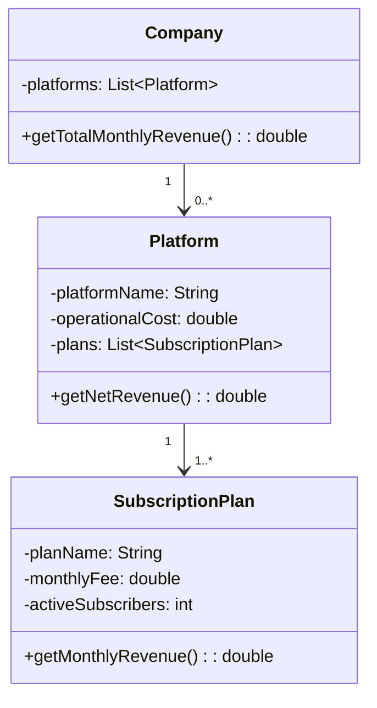

### 📘 Problem Statement

A tech company operates multiple digital platforms (e.g., a music streaming service, a fitness app, and an educational portal). Each platform offers different **subscription plans** (e.g., Basic, Premium, Family), and each subscription has a **monthly fee** and a **number of active subscribers**.

Each platform also incurs a **monthly operational cost** (e.g., hosting, content licensing, support). The platform's **net revenue** is calculated by summing up all income from subscriptions and subtracting the operational cost.

The company wants a program that will calculate:

- The **monthly net revenue for each platform**, and
- The **total monthly revenue across all platforms**.

### 🔧 Suggested Classes

- `Company`
- `Platform`
- `SubscriptionPlan`

------

Great! Here's **everything you asked for**: a full design of the **Subscription Service Revenue Tracker**.

------

## ✅ 1. UML Class Diagram (Mermaid)



## ✅ 2. Full Java Implementation

### 🔹 `SubscriptionPlan.java`

```java
public class SubscriptionPlan {
    private String planName;
    private double monthlyFee;
    private int activeSubscribers;

    public SubscriptionPlan(String planName, double monthlyFee, int activeSubscribers) {
        this.planName = planName;
        this.monthlyFee = monthlyFee;
        this.activeSubscribers = activeSubscribers;
    }

    public double getMonthlyRevenue() {
        return monthlyFee * activeSubscribers;
    }

    public String getPlanName() {
        return planName;
    }
}
```

------

### 🔹 `Platform.java`

```java
import java.util.*;

public class Platform {
    private String platformName;
    private double operationalCost;
    private List<SubscriptionPlan> plans;

    public Platform(String platformName, double operationalCost) {
        this.platformName = platformName;
        this.operationalCost = operationalCost;
        this.plans = new ArrayList<>();
    }

    public void addPlan(SubscriptionPlan plan) {
        plans.add(plan);
    }

    public double getNetRevenue() {
        return plans.stream()
                .mapToDouble(SubscriptionPlan::getMonthlyRevenue)
                .sum() - operationalCost;
    }

    public String getPlatformName() {
        return platformName;
    }
}
```

------

### 🔹 `Company.java`

```java
import java.util.*;

public class Company {
    private List<Platform> platforms;

    public Company() {
        this.platforms = new ArrayList<>();
    }

    public void addPlatform(Platform platform) {
        platforms.add(platform);
    }

    public double getTotalMonthlyRevenue() {
        return platforms.stream()
                .mapToDouble(Platform::getNetRevenue)
                .sum();
    }
}
```

------

### 🔹 `Main.java`

```java
public class Main {
    public static void main(String[] args) {
        Company company = new Company();

        Platform music = new Platform("MusicStream", 20000);
        music.addPlan(new SubscriptionPlan("Basic", 5.99, 1000));
        music.addPlan(new SubscriptionPlan("Premium", 9.99, 800));

        Platform fitness = new Platform("FitLife", 15000);
        fitness.addPlan(new SubscriptionPlan("Standard", 7.99, 600));
        fitness.addPlan(new SubscriptionPlan("Pro", 11.99, 300));

        company.addPlatform(music);
        company.addPlatform(fitness);

        System.out.println("Revenue Report:");
        for (Platform p : List.of(music, fitness)) {
            System.out.printf("%s: $%.2f%n", p.getPlatformName(), p.getNetRevenue());
        }

        System.out.printf("Total Monthly Revenue: $%.2f%n", company.getTotalMonthlyRevenue());
    }
}
```


------

## 