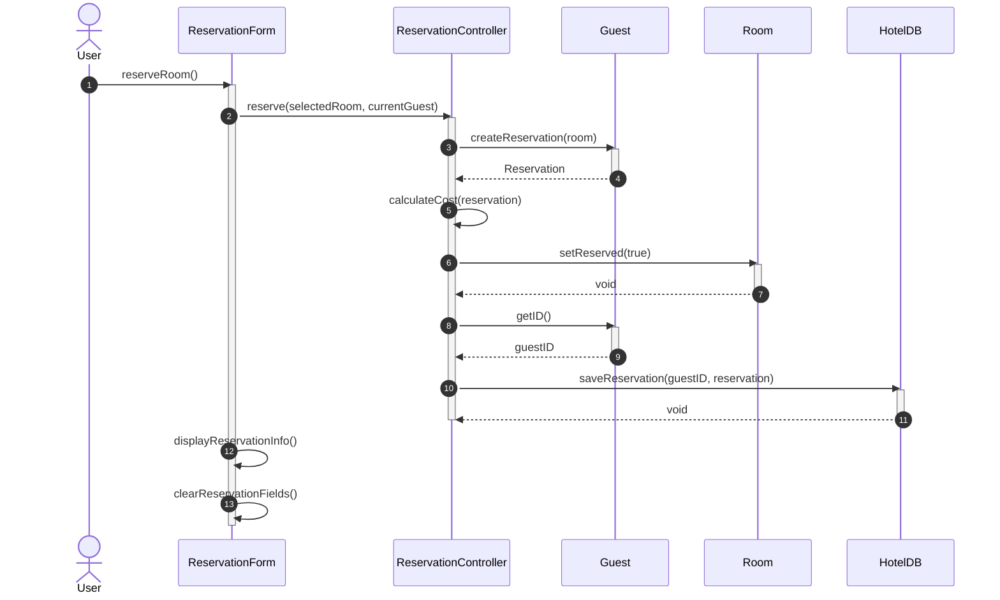

# MED-TERM-EXAM PRACTICE

## EX 4

Create a sequence diagram based on the flow that occurs when an actor invokes the reserveRoom method on ReservationForm. You must use correct numbering and activation bars (in the correct way!). You must show all parameters.

```java
public void reserveRoom() {
  reservationController.reserve(selectedRoom, currentGuest);
  displayReservationInfo();
  clearReservationFields();
}

// FROM CLASS ReservationController
public void reserve(Room room, Guest guest) {
  Reservation reservation = guest.createReservation(room);
  double totalCost = calculateCost(reservation);
  room.setReserved(true);
  hotelDB.saveReservation(guest.getID(), reservation);
}
```


**Instructions:**

- Identify all objects involved and the order of method calls.
- Show all parameters in your sequence diagram.
- Use activation bars and proper sequence numbering.



