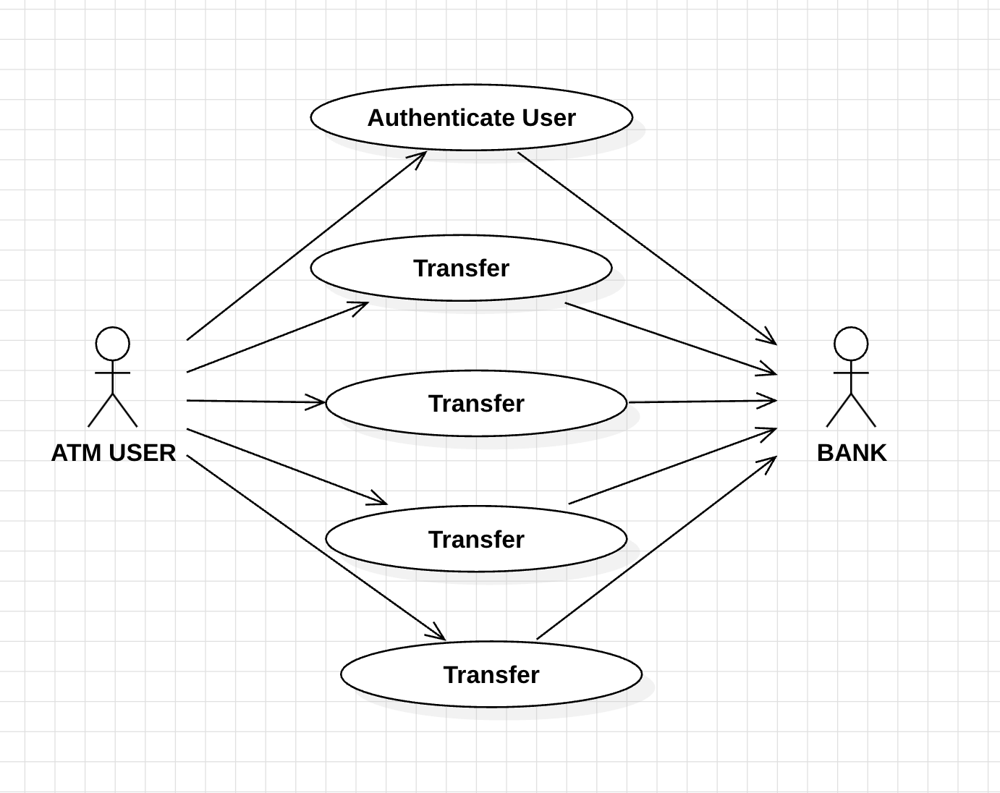
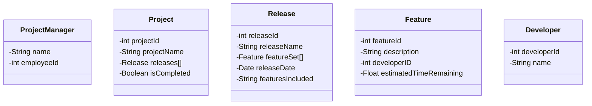
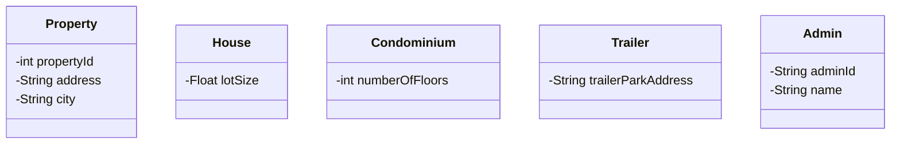

# Lab 1 - Responses

1. Below is a table showing the first step in a use case description for the main flow of the Withdraw Money use case for an ATM system. Use your experience with ATM machines to help you fill out the rest of the table. The goal of the Withdraw Money use case is, of course, to withdraw money from your account, and in the Main Flow of this use case, the goal is achieved as expected.

### WITHDRAW_MONEY Use Case Description: Main Flow

| User Action                                        | System Response                                              |
| :------------------------------------------------- | ------------------------------------------------------------ |
| User types in PIN into main screen                 | System checks validity of PIN and presents options to user on another screen |
| User select "Withdraw" option                      | System save type and request type of account                 |
| User selects "type account" "saving" or "Checking" | System save the type account  selected and system request amount to withdraw |
| User confirmed transactions                        | System displays the amount of user requests.                 |
| User accept or decline print recept                | System ask if user want to print transaction                 |
| User take money                                    | System release money an deducts it form user's account       |
|                                                    |                                                              |

### Guidelines:

1. Write a user story from the perspective of an ATM user trying to withdraw money.

   **As a  ATM user, I want to withdraw my savings from an account.**

----------

2. Create a User Case Diagram for the ATM system (refer to the slides for the three use cases that you will use). there shoud be two actors.

   

   

---

3. The Project Management Tracking System. The following is a problem statement for building a simple project management tool. The tool would be used by a Project Manager (who would be an Actor in relation to this system, and we can assume that the final system will have a user interface which would be used by the Project Manager. Use the techniques discussed in class to create a static model

________

4. **Properties Management System.** The following is a problem statement for a simple properties management system, which would be used by a manager of multiple properties. Use the techniques discussed in class to create a static model - identify the classes for this system and determine the attributes that belong to each class. We will develop this example further later on - for this lab, you do not need to specify associations or operations.

