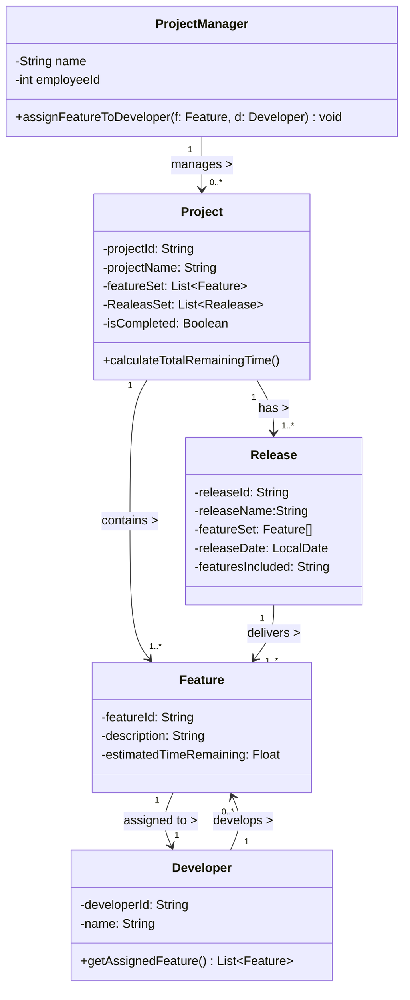

# Lab 2

>  *Reading:* Beginning Java Objects, pp. 368—385 

1. Extend your work on the project management system from Problem 3 of Lab 1 so that your class diagram includes associations and dependencies, with names (optionally, roles), and multiplicities shown. Also include in your classes any operations that seem to be suggested by the associations you have added to your diagram. Below is a reproduction of the problem statement. 


> Problem Description:
>
> A Project Manager manages multiple projects. A project, before final release, is required to have a specified feature set. Associated with a project are multiple releases. A release is a functional piece of the project being developed that includes a subset of the feature set for the project and which is to be delivered on a specified date (the feature set and release date are determined by the Project Manager). When the last release is delivered, the project is considered completed.
>
> Associated with each feature for a project is a developer who is responsible for developing this feature for inclusion in the project. A developer has an id and provides, for each feature he is responsible for, the estimated time remaining to complete work on that feature. The Project Manager assigns features to developers to work on



________

2. For each of the following small class diagrams, write corresponding Java code and create a main method that creates instances of the classes in the diagram in a way that agrees with the requirements of the diagram. For example, in a 1-1 two-way association between A and B, whenever an instance of A is created, an instance of B must also be created and each must contain an instance of the other.

>Name your java packages for these as follows: prob2A, prob2B


-----

3. Draw a class diagram for each of the following:

   A.   Position Hierarchy:A position may or may not be a managerial position. Each position reports to its managerial position if it has one. A managerial position could have any number of positions reporting to it

   ```mermaid
   classDiagram
   
     %% Self-association: one position reports to another
     Position "0..1" --> "0..*" Position : reportsTo >
   
   ```

   

   B.   Course Prerequisites: **A** university course may or may not require the student to have taken other courses first before taking this one. Any course can be a prerequisite course for any other course, except for itself.

   ```mermaid
   classDiagram
     %% Self-association: prerequisites
     Course "0..*" --> "0..*" Course : prerequisites >
     Course "1" --> "0..*" Student : has >
   
   ```

   
