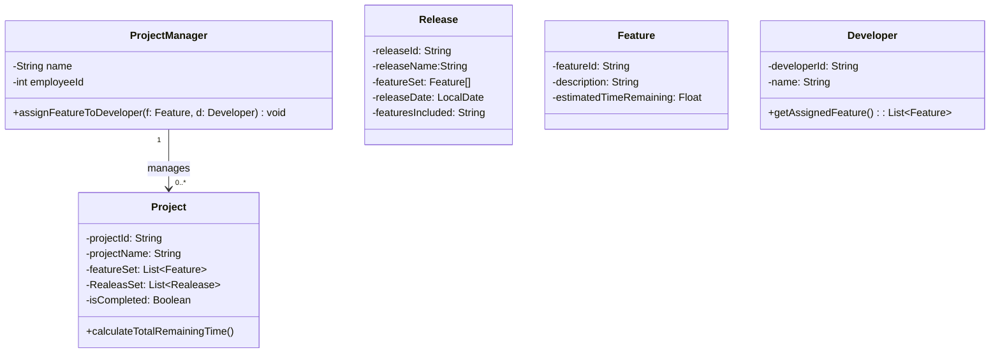

# Lab 2

>  *Reading:* Beginning Java Objects, pp. 368—385 

1. Extend your work on the project management system from Problem 3 of Lab 1 so that your class diagram includes associations and dependencies, with names (optionally, roles), and multiplicities shown. Also include in your classes any operations that seem to be suggested by the associations you have added to your diagram. Below is a reproduction of the problem statement. 

> Problem Description:
>
> A Project Manager manages multiple projects. A project, before final release, is required to have a specified feature set. Associated with a project are multiple releases. A release is a functional piece of the project being developed that includes a subset of the feature set for the project and which is to be delivered on a specified date (the feature set and release date are determined by the Project Manager). When the last release is delivered, the project is considered completed.
>
> Associated with each feature for a project is a developer who is responsible for developing this feature for inclusion in the project. A developer has an id and provides, for each feature he is responsible for, the estimated time remaining to complete work on that feature. The Project Manager assigns features to developers to work on

________

