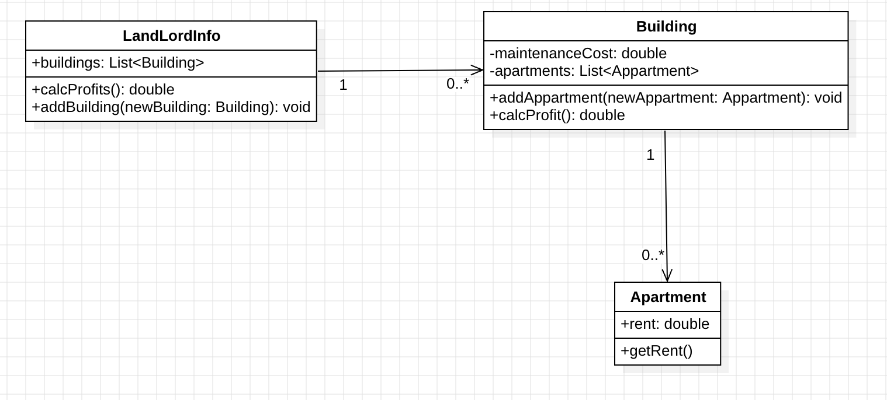
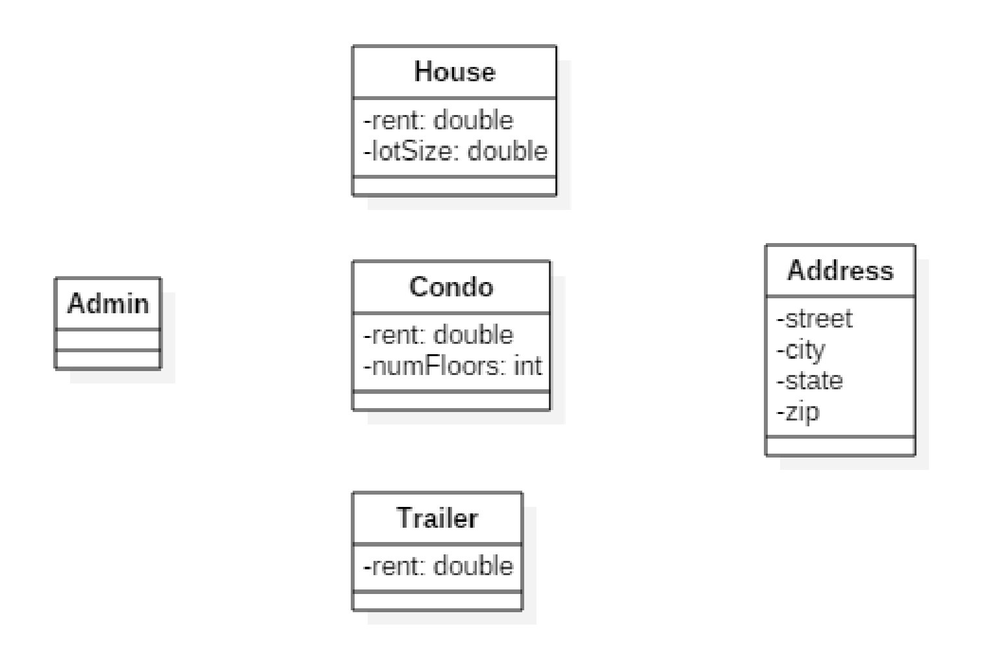
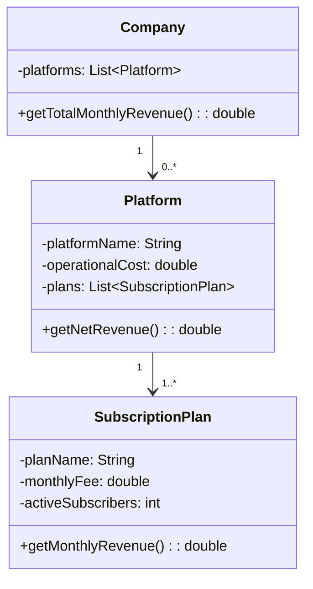

# Lab 3

### Solution

https://github.com/leone2016/MPP_ASSIGNMENTS/tree/main/lab3/PracticeLab3

1. In the code folder for this lab there is a package lesson3.labs.prob1 containing two classes, Person and PersonWithJob. In each class, the equals method has been overridden. Run the main method in the PersonWithJob class. In the main method, two instances of Person have been compared to determine if they are equal. The comparison is done in two different ways. One way leads to a “false”, the other to a “true.” Explain why this has happened. Then provide a solution by replacing inheritance with composition. 

   

   ### Why  are they different?

   **PersonWithJob** extends **Person**, Inheritance create an ambiguous equality definition where **PersonWithJob** it's the same as **Person**

   `p1.equals(p2) -> false`, it uses equals of PersonWithJob, because p1 is instance of PersonWithJob and p2 is a Person it returns false.

   `p2.equals(p1) -> true`, it uses equals of Person, because p2 is a instance of Person and p1 is Person (PersonWithJob is subClass of Person) then return true

   ### [Solution on GitHub.](https://github.com/leone2016/MPP_ASSIGNMENTS/tree/main/lab3/PracticeLab3/src/prob1)

   

2. Design a solution to the problem given below (in UML), and then implement in code. A Main class has been provided in the startup code that hard-codes values and attempts to test your code. However, the Main class attempts to populate the classes in this problem in a way that violates the one-many relationships between the classes – and if you place the Main class in a different package, you will see that data-loading code does not work. As part of this exercise, refactor the code in the Main class so that it loads data in a way that accords with the class design. (Note that the problem in this case is different from the one given in Lab 1.) 

   > Problem 2: Problem Statement
   >
   > A landlord owns multiple buildings, each building has multiple apartments. Each apartment has a rent associated with it. Each building generates profit which is the sum of all the apartment rents minus the building maintenance costs. Write a program that will calculate the landlord's monthly total profits.

   ### [Solution on GitHub.](https://github.com/leone2016/MPP_ASSIGNMENTS/tree/main/lab3/PracticeLab3/src/prob2)

   

   

3. In Lab 1 a properties management system was introduced. In that lab, you specified classes and some attributes for those classes. In this exercise, think of a way to design further using inheritance and include associations (with multiplicities) and some operations for your classes. Then translate your diagram into Java code. Both an Admin and Driver class have been provided in your code folder. The Driver class creates some instances of the different properties and passes these into the Admin method computeTotalRent; this method performs a correct computation, but the implementation proceeds by checking the types of the different rental properties. Refactor the implementation of computeTotalRent so that the inheritance you have introduced is used, together with polymorphism. Below is provided the problem statement and a solution for the Lab 1 exercise.

   ### [Solution](https://github.com/leone2016/MPP_ASSIGNMENTS/tree/main/lab3/PracticeLab3/src/prob2)

   

> Problem Description:
>
> A landlord owns several types of properties: houses, condominiums, and trailers.
>
> A house has an address and a lot size. Rent for a house is computed by
>
> rent = 0.1 * lot size
>
> A condominium has an address and a certain number of floors (1 floor, 2 floors, or 3 floors). Rent for a condominium is computed by
>
> rent = 400 * number of floors
>
> A trailer belongs to a particular trailer park (specified by the trailer park address).
>
> The rent for a trailer is always $500.
>
> The property managemet software is required to have an Admin module that supports various functions. One of these functions is to compute total rent for all the properties registered in the system. Another function is to list all properties in the system that are in a specified city.
>
> 

-------

PRACTICE EXAM

